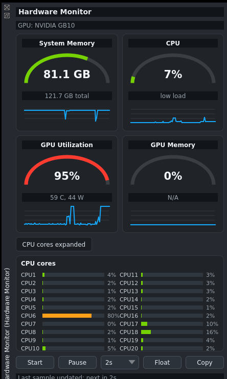

# napari-hardware-monitor

Lightweight local hardware monitoring for napari.

`napari-hardware-monitor` adds a compact dashboard dock for watching CPU, system memory, GPU activity, and GPU memory while image-analysis and local AI workflows run. It is designed for users who want immediate visibility into whether napari, segmentation models, vision models, or large image data are putting pressure on the machine.



## First Release

Version `0.1.0` focuses on a small, reliable monitor:

- compact dark dashboard with gauge cards and short history traces
- CPU utilization
- optional per-core CPU utilization
- system memory usage
- NVIDIA GPU utilization through `nvidia-smi`
- NVIDIA VRAM usage when reported by the driver
- GPU temperature and power draw
- Start / Pause monitoring
- refresh interval selector
- Float button for detaching the monitor dock when napari exposes a dock container
- Copy Snapshot for bug reports, benchmarking notes, or reproducibility records

Per-core CPU detail is collapsed by default. The main view stays focused on the common question: is the workflow limited by CPU, RAM, GPU, or VRAM?

## Why This Plugin Exists

Local image analysis is increasingly hardware-dependent. When a user loads a large TIFF or OME-Zarr, runs SAM, Cellpose, StarDist, a local Ollama vision model, or another GPU-backed workflow, they often need to know:

- Is the GPU actually being used?
- Is VRAM full?
- Is system RAM becoming the bottleneck?
- Is the CPU busy while the GPU is idle?
- Did a model finish, stall, or continue running in the background?

This plugin gives that signal directly inside napari without opening a separate system monitor.

## Scope

`napari-hardware-monitor` is a hardware visibility plugin. It is not a profiler, model launcher, training manager, benchmark suite, or process attribution tool.

It is meant to sit beside tools such as:

- `napari-chat-assistant`: local text assistant
- `napari-vision-assistant`: local image + text vision assistant
- segmentation and model plugins that consume CPU/GPU resources

The values are system-level. They tell users what the machine is doing, not which exact plugin or process caused the load.

## GPU Support

NVIDIA GPU monitoring uses `nvidia-smi`.

If `nvidia-smi` is unavailable, the plugin still shows CPU and system memory and displays a clear no-GPU fallback. Multi-GPU systems are summarized as aggregate VRAM, maximum GPU utilization, maximum temperature, and total power draw.

Some platforms or drivers may report GPU activity but not VRAM totals. In that case the GPU memory card shows `N/A` rather than pretending the value is known.

## Usage

Open napari and choose:

```text
Plugins > Hardware Monitor
```

Controls:

- `Start`: begin automatic polling.
- `Pause`: stop polling while keeping the last values visible.
- `1s / 2s / 5s`: choose refresh interval. `2s` is the default balance between responsiveness and overhead.
- `Float`: detach the monitor dock when the napari dock container supports it.
- `Copy`: copy a plain-text hardware snapshot.
- `CPU cores`: expand optional per-core CPU usage.

## Installation

```bash
pip install napari-hardware-monitor
```

## Development

```bash
git clone https://github.com/wulinteousa2-hash/napari-hardware-monitor.git
cd napari-hardware-monitor
pip install -e ".[test]"
pytest -q
napari
```

## Design Notes

- Polling runs off the Qt UI thread so a slow `nvidia-smi` call does not freeze the dock.
- The dashboard uses Qt painting directly and avoids heavy plotting dependencies.
- The dashboard keeps only a short in-memory history, so it stays lightweight during long napari sessions.
- Individual CPU cores are available as an optional detail panel, not as default dashboard clutter.
- The first release intentionally stays small: clear local hardware visibility is the core value.

## Release Notes

### 0.1.0

Initial release.

- Added compact napari dock widget.
- Added CPU, RAM, GPU, and VRAM dashboard cards.
- Added gauge and sparkline visualizations.
- Added optional per-core CPU panel.
- Added asynchronous hardware polling.
- Added NVIDIA GPU support through `nvidia-smi`.
- Added multi-GPU summary behavior.
- Added dock float action, refresh control, pause/start, and copy snapshot.
