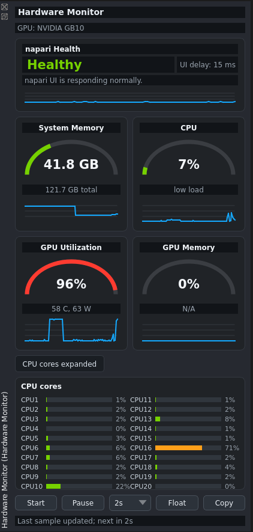

# napari-hardware-monitor

Hardware and responsiveness monitoring inside napari.

`napari-hardware-monitor` adds a compact dock for watching napari UI responsiveness, CPU, system memory, GPU activity, and GPU memory while image-analysis and local AI workflows run.



## Features

- napari Health card with Qt event-loop delay and recent-freeze readout
- CPU, system RAM, NVIDIA GPU, and VRAM monitoring
- GPU temperature and power draw when reported by `nvidia-smi`
- compact gauge cards with short history traces
- optional per-core CPU panel
- Start / Pause, refresh interval, Float / Attach, and Copy Snapshot controls

## Why This Plugin Exists

Large images and local AI workflows can make napari slow or briefly unresponsive.

The operating system may show a "`napari` is not responding" dialog with `Wait` and `Force Quit`, but that appears only after the UI is already stuck. It does not keep a history or help after napari responds again.

This plugin adds the missing context inside napari:

- current hardware pressure from CPU, system RAM, GPU, and VRAM
- UI responsiveness from Qt event-loop delay
- a recent-freeze readout, such as `4500 ms, 18s ago`, after recovery

It does not identify the exact code that caused a freeze. After napari responds again, it shows how long the UI was delayed and what the surrounding hardware state looked like, so users have useful context for adjusting the workload or reporting the issue.

## Scope

`napari-hardware-monitor` is a hardware and responsiveness visibility plugin. It is not a profiler, model launcher, training manager, benchmark suite, or process attribution tool.

The values are system-level. They tell users what the machine is doing, not which exact plugin or process caused the load.

## GPU Support

NVIDIA GPU monitoring uses `nvidia-smi`. If it is unavailable, the plugin still shows CPU and system memory with a clear no-GPU fallback.

Multi-GPU systems are summarized as aggregate VRAM, maximum GPU utilization, maximum temperature, and total power draw. If a driver reports GPU activity but not VRAM totals, the GPU memory card shows `N/A`.

## Usage

Open napari and choose:

```text
Plugins > Hardware Monitor
```

Controls:

- `Start`: begin automatic polling.
- `Pause`: stop polling while keeping the last values visible.
- `1s / 2s / 5s`: choose refresh interval.
- `Float` / `Attach`: detach or reattach the monitor dock when the napari dock container supports it.
- `Copy`: copy a plain-text hardware and napari health snapshot.
- `CPU cores`: expand or collapse optional per-core CPU usage.

## Installation

```bash
pip install napari-hardware-monitor
```

## Development

```bash
git clone https://github.com/wulinteousa2-hash/napari-hardware-monitor.git
cd napari-hardware-monitor
pip install -e ".[test]"
pytest -q
napari
```

## Design Notes

- Polling runs off the Qt UI thread so a slow `nvidia-smi` call does not freeze the dock.
- napari Health is measured on the Qt UI thread using event-loop delay.
- Recent freeze information stays visible briefly after recovery.
- The dashboard uses Qt painting directly and avoids heavy plotting dependencies.
- The dashboard keeps only a short in-memory history.
- Per-core CPU detail is collapsed by default.

## Release Notes

### 1.1.0

Usability and responsiveness diagnostics release.

- Added sticky recent-freeze readout with duration and age.
- Added recent-freeze details to copied snapshots.
- Increased default dock width and height for clearer metric cards.
- Improved metric card sizing so GPU information is not clipped.
- Made CPU cores collapse restore the compact dock height.
- Changed Float into a Float / Attach toggle when napari exposes dock floating APIs.

### 1.0.0

Stable responsiveness release.

- Added napari Health card.
- Added Qt event-loop delay monitoring.
- Added readable health states: Healthy, Busy, Lagging, and Frozen recently.
- Added health hints for common bottlenecks.
- Added napari health details to copied snapshots.

### 0.1.0

Initial release.

- Added compact napari dock widget.
- Added CPU, RAM, GPU, and VRAM dashboard cards.
- Added gauge and sparkline visualizations.
- Added optional per-core CPU panel.
- Added asynchronous hardware polling.
- Added NVIDIA GPU support through `nvidia-smi`.
- Added multi-GPU summary behavior.
- Added dock float action, refresh control, pause/start, and copy snapshot.
